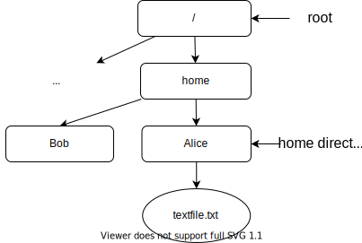

.. _sec-bash:

Terminal - Bash
###############

One crucial tool a developer needs is a *terminal*. It is a tool to interact differently with your computer, i.e., using a `command line interface (CLI) <https://en.wikipedia.org/wiki/Command-line_interface#Anatomy_of_a_shell_CLI>`_. In other words, it allows you to give text commands to the operating system, instead of manipulating graphical elements (windows, icons, …). While the latter is easier to begin with, the former has the advantages to allow scripting and automation of your tasks, to use less resources, and it only uses the keyboard which can make you more efficient.

.. only:: not latex

    Live examples are available via `asciinema <https://asciinema.org>`__ files. Note that there are not just videos, you can also copy/paste displayed command lines. Try to understand and to reproduce them in your own terminal.

.. _sec-bash-terminology:

Terminology
===========

.. figure:: ../_static/svg/terminal_bash/terminal.drawio.svg

   Terminology

-  `Command-line interpreter <https://en.wikipedia.org/wiki/Command-line_interface>`__, or *shell*: a program that processes commands, which allows users to access operating system’s services. The syntax (command’s names, arguments, …) is specific to the shell. Examples of shells: ``sh``, ``bash`` (the most common), ``fish``, and ``zsh`` which is discussed :ref:`here <sec-zsh>`. A command is typically its name with eventually some arguments. For example,

   .. code-block:: bash

      echo 'Hello World!'

   where ``echo`` is the command we wish to execute, and ``'Hello World!'`` is its argument. Here the command just prints its argument, give it a try 😉

   .. note:: Commands can have multiple arguments, delimited by whitespace characters, and even options, usually with a long name ``--option1`` and a short name ``-opt1`` (note the number of dashes). For example:
      
      .. code-block:: bash

         echo -e 'Little darling\nThe smiles returning to the faces' 'Little darling'

      will print all its arguments and the flag ``-e`` enables the interpretation of the escape character ``\n``.

-  `Terminal <https://en.wikipedia.org/wiki/Terminal_emulator>`__, or *terminal emulator*: a text interface to a shell. In other words, it is the software in which users can access to the command-line interface. Before, terminal refereed to a physical hardware with a keyboard and a monitor. They are now mostly *virtual*, and in practice, it is the window in which we can interact with a shell. Examples of terminals (see `list <https://en.wikipedia.org/wiki/List_of_terminal_emulators>`__):

   -  on macOS: `Terminal.app <https://en.wikipedia.org/wiki/Terminal_(macOS)>`__, `iTerm2 <https://www.iterm2.com>`__, …
   -  on Linux: `Konsole <https://konsole.kde.org>`__, `GNOME terminal <https://en.wikipedia.org/wiki/GNOME_Terminal>`__, …
   -  on Windows: `Windows Terminal <https://devblogs.microsoft.com/commandline/introducing-windows-terminal/>`__, `PuTTY <https://www.chiark.greenend.org.uk/~sgtatham/putty/>`__, …

-  `Command prompt <https://en.wikipedia.org/wiki/Command-line_interface#Command_prompt>`__: a sequence of characters in the command-line interface (CLI) that tells you the shell is ready to accept a command. It *prompts* you to give a command. It usually contains other information (path of the current directory, hostname, …).

.. note:: VS Code comes with its own `terminal <https://code.visualstudio.com/docs/terminal/basics>`_, which you can use along side having opened files and editing them.
   
Filesystem
==========

Files are usually displayed in a hierarchical tree structure, where each node is a directory. In :numref:`bash-fig-directory-hierarchy`, you can see a typical filesystem for an operating system with two users, Alice and Bob. Both of them have their own directory, called *home directory*, where they can put their documents, install their software programs, etc. Every file and directory is under the *root* directory ``/``, which is literally the root of the hierarchical tree structure.

.. _bash-fig-directory-hierarchy:

   Directory hierarchy

Every process (shell, commands that are executed, ...) has a *current working directory*, which is simply the directory in which it is working from. For example, a user starting a new shell will usually have the home directory as current working directory.

Now that we understand that each directory and file are parts of a hierarchical tree structure, we need to locate them in this structure. To do that, we use a *path*, a string of characters composed by directory names and a delimiting character: ``/`` on Unix systems. There are two types of path:

- *absolute path*, which corresponds to the location starting from the root directory. For example ``/home/Alice/textfile.txt``.
- *relative path*, which corresponds to the location starting from the current working directory. Assuming the latter is ``/home/Bob``, the relative path to ``textfile.txt`` would be ``../Alice/textfile.txt``, where ``..`` refers to the parent directory.

.. _sec-bash-variables:

Variables
=========

Shells can often be seen also as `programming languages <https://www.gnu.org/software/bash/manual/html_node/What-is-a-shell_003f.html>`_, in particular you can write scripts with variables, if/for loops, and functions. We will not dive in too much in this direction, but we need to understand at least variables.  

You can set variables using ``=`` (without whitespaces around), here is an example with a variable containing a string:

.. code-block:: bash

   my_variable="Hello World!"

And you refer to the value of a variable using ``$``, 

.. code-block:: bash

   echo $my_variable

This is important to understand because when starting a shell, it sets *environment variables* to record the properties of the new shell session. You can see the active environment variables using the command ``env``. In particular, you should find the following variables:

- ``HOME`` containing the path to the home directory,
- ``SHELL`` containing the path to the shell,
- ``PWD`` containing the path to the current directory,
- ``PATH`` containing a list of important paths, used when compiling code for example,

and many others... It also sets a number of other variables (that you can also print with the command ``set``), including the variable ``PS1``. This variable contains the command prompt, which was mentionned in :ref:`sec-bash-terminology` . By default, it usually contains only ``$``, but it can be customized to display more information.

.. only:: not latex

   In the following asciinema examples, I will use a customized prompt that displays the current directory followed by a line break and the character ``$``. 

Navigation
==========

Once you have started a shell session, the first thing you can try is to check where you are on your laptop with the command ``pwd`` (**p**\ rint **w**\ orking **d**\ irectory).

.. code-block:: bash
   
   pwd

It will print out the absolute path to your current directory, something like ``/home/YourName``. To change the current directory, you can use ``cd`` (**c**\ hange **d**\ irectory) followed by the (absolute or relative) path of its new location. For example, if we want to go the root directory.

.. code-block:: bash
   
   cd /

Then, you can check that you are at the root directory using again ``pwd``.

.. tip:: 
   - Calling ``cd`` without argument changes the current directory to your home repository.
   - Calling ``cd -`` changes the current directory to its previous location.
   - Calling ``cd ~`` changes the current directory to the home directory.
   - Calling ``cd ..`` changes the current directory to its parent directory.

.. note:: 
   - You can make a path combining different shortcuts, for example ``cd ~/../..`` will change the current directory to the root directory in the previous :ref:`example <bash-fig-directory-hierarchy>` (home directory, then go up two levels).

To know where to go, you may need to know what are the files and directory contained in a given directory. You can use ``ls`` (**l**\ ist **f**\ iles) to print them out.

.. only:: not latex

   Here is a small example illustrating the previous commands where the structure is the same as in :numref:`bash-fig-directory-hierarchy`.

   .. asciinema:: ../_static/asciicast/bash/navigation_output.cast
      :rows: 19

Change to the filesystem
==========================

We can now start to modify the hierarchical structure adding and removing files and directories.

- To create an empty file named ``my_textfile.txt``, use ``touch``

.. code-block:: bash

   touch my_textfile.txt

- To create an empty directory name ``my_directory``, use ``mkdir`` (**m**\ a\ **k**\ e **dir**\ ectory)

.. code-block:: bash

   mkdir my_directory

- To remove a file name ``my_textfile.txt``, use ``rm`` (**r**\ e\ **m**\ ove)

.. code-block:: bash

   rm my_textfile.txt

- To remove a directory named ``my_directory``, use ``rm`` with the flag ``-r`` or ``--recursive`` to allow recursive deletion of the directory's content

.. code-block:: bash

   rm -r directory

.. warning:: Be careful when deleting files and directories, it is quite involved/impossible to recover what you delete with ``rm`` (no recycle bin), and you risk breaking your system by deleting the wrong file or directory. 

.. only:: not latex

   Here is a small example illustrating the previous commands where the structure is the same as in :ref:`bash-fig-directory-hierarchy`.

   .. asciinema:: ../_static/asciicast/bash/change_structure_output.cast
      :rows: 30

Tips and tricks
===============

.. rubric:: Autocompletion 
   
Use ``tab`` to autocomplete paths. When writing the beginning of path, use ``tab`` to autocomplete. If there is not a unique possibility, it will display the different possibility.

.. only:: not latex

   .. asciinema:: ../_static/asciicast/bash/autocompletion_output.cast
      :rows: 11

   In this example, I use ``tab`` on the second line to avoid writing the long name of the directory.

.. rubric:: Navigate in your history

Use ``Up`` arrow to navigate through your command history.

.. only:: not latex
      
   .. asciinema:: ../_static/asciicast/bash/history_output.cast
      :rows: 15

   In this example, I type ``Up`` three times to recover the first command I typed, and then ``enter`` to run the command.

.. rubric:: Backward research
   
Use ``ctrl-r`` to look for previous command calls. Use ``ctrl-r`` and type the beginning of the command you are looking for in your history, and you want to recover. It will show you the last command you used starting by what you typed, and you can use ``ctrl-r`` to look for previous commands starting by what you typed.

.. only:: not latex
      
   .. asciinema:: ../_static/asciicast/bash/backward_search_output.cast
      :rows: 15

   In this example, I use ``ctrl-r`` once, I then start to write ``tou`` so that it displays the last command starting by *tou*, and finally use again ``ctrl-r`` to search for the previous command starting by *tou*.

.. rubric:: Man page

To learn how to use a command, use the command ``man`` with the name of the command as argument. For example ``man echo`` displays to manual for the command ``echo`` (type ``q`` to leave).

.. only:: not latex
      
   .. asciinema:: ../_static/asciicast/bash/man_page_output.cast
      :rows: 26

.. rubric:: explainshell.com

This `website <https://explainshell.com>`_ explains commands and their flags. Just write down ``echo -e``, then it will show you what ``echo`` is for, and what ``-e`` means for this command. It is a more visual way to access to the man page mentioned above for a given command and the specific flags you used. Note that I am not affiliated to this website.

Notes for VS Code users
=======================

As we previously mentioned, VS Code comes with its own `terminal <https://code.visualstudio.com/docs/terminal/basics>`_ where you can use any shell available on your workstation, so no need for an extension a priori. Everything we mentioned here should work since it does not depend on the terminal, but is related to the bash shell.

That being said, I should point out that VS Code's terminal has some nice features you should be aware of, for examples:

- Terminal processes are `restored <https://code.visualstudio.com/docs/terminal/basics#_terminal-process-reconnection>`_ on window reload, if you reload your VS Code window for example, it will not kill your shell session.
- Every path or URL displayed in the terminal is a `link <https://code.visualstudio.com/docs/terminal/basics#_links>`_, meaning you can left-click holding ``Ctrl/Cmd`` [#]_ to use it (as in the editor). For a file, it will open it in an editor, which is very useful when compiling or debugging.
- You can use "`Find <https://code.visualstudio.com/docs/terminal/basics#_find>`_" in the terminal using ``Ctrl/Cmd+f`` as you would expect.

VS Code also added recently a new feature called `Terminal Shell Integration <https://code.visualstudio.com/docs/terminal/shell-integration>`_. For common shells (including bash), VS Code can understand what is happening inside the shell, which allows him to add some other nice features, for example:

- `Command decorations <https://code.visualstudio.com/docs/terminal/shell-integration#_command-decorations-and-the-overview-ruler>`_: VS Code recovers the exit code of each command you call and displays blue dot on the left if it succeeded, a red one otherwise.
- `Command navigation <https://code.visualstudio.com/docs/terminal/shell-integration#_command-navigation>`_: you can quickly navigate between commands using ``Ctrl/Cmd+Up`` and ``Ctrl/Cmd+Down``.

I only mentioned some features for VS Code's terminal and shell integration, go look at the documentation to see them all. Besides, they will probably add more features in the near future.

References
===========

.. rubric:: Terminology

-  Wikipedia for `command-line interface <https://en.wikipedia.org/wiki/Command-line_interface#Anatomy_of_a_shell_CLI>`__, `terminal emulator <https://en.wikipedia.org/wiki/Terminal_emulator>`__
-  Questions on StackEchange: `Unix&Linux <https://unix.stackexchange.com/questions/4126/what-is-the-exact-difference-between-a-terminal-a-shell-a-tty-and-a-con>`__ and `superuser <https://superuser.com/questions/144666/what-is-the-difference-between-shell-console-and-terminal>`__
-  `List <https://en.wikipedia.org/wiki/List_of_terminal_emulators>`__ of terminal emulators
-  `Video <https://www.youtube.com/watch?v=hMSByvFHOro>`__ of Luke Smith defining the terminology.

.. rubric:: Filesystem

- Wikipedia for Unix and Unix-like filesystems: `Filesystem Hierarchy Standard <https://en.wikipedia.org/wiki/Filesystem_Hierarchy_Standard>`_
- Wikipedia for `home directory <https://en.wikipedia.org/wiki/Home_directory>`_, `root directory <https://en.wikipedia.org/wiki/Root_directory>`_, `working directory <https://en.wikipedia.org/wiki/Working_directory>`_, `path <https://en.wikipedia.org/wiki/Path_(computing)>`_

.. rubric:: Integrated terminal in VS Code

- VS Code's Documentation on its `integrated terminal <https://code.visualstudio.com/docs/terminal/basics>`_
- `Mastering VS Code's Terminal <https://www.growingwiththeweb.com/2017/03/mastering-vscodes-terminal.html>`_: a blog with a lot of tips to improve and customize VS Code's terminal

.. [#] 
   It means ``Ctrl``, expect on macOS where ``Cmd`` should be used instead.
